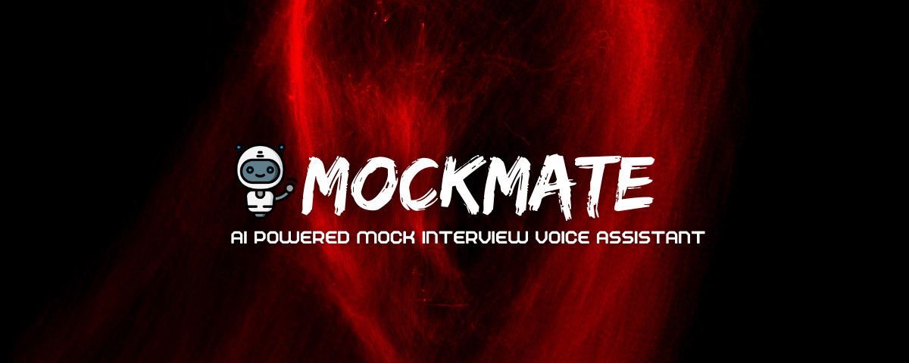

# MockMate — AI-Powered Mock Interviews Voice Assistant

 “Don’t practice until you get it right — practice until you can’t get it wrong.”
 
 **MockMate** helps you do exactly that. Meet your **AI interviewer**, get **real-time feedback**, and **master your dream role** — all in one place.


<p align="center">
  
</p>


## What is MockMate?

**MockMate** is not just another web app — it’s your **personal AI interview partner**.  
Built with **Next.js**, **Firebase**, **Tailwind CSS**, and powered by **Google Gemini** & **Vapi AI Voice Agents**, it helps users **prepare for job interviews** through **realistic AI conversations**, **instant performance feedback**, and **smart insights**.

Whether you're preparing for your **first job** or a **career leap**, MockMate brings your interview practice to life — literally.


### Demo Video

[](https://youtu.be/KcCg-5KDakk)


## Tech Stack

| Category | Technology |
|-----------|-------------|
| Frontend | **Next.js**, **Tailwind CSS**, **shadcn/ui** |
| Backend | **Firebase Authentication**, **Firestore Database** |
| AI & Voice | **Vapi AI**, **Google Gemini** |
| Validation | **Zod** |
| Hosting | **Vercel** |


## Core Features

### 🔐 Authentication  
Sign up and sign in securely using **Firebase Email/Password Authentication**.

### 🎙️ AI Voice Interviews  
Generate and take interviews with **Vapi AI Voice Agents** — practice talking like a real conversation with an intelligent interviewer.

### 📊 Dashboard Management  
View all your created interviews, track your progress, and revisit past sessions with detailed data.

### 💬 Interactive Transcripts  
Get **real-time transcripts** of your interview, with timestamps and AI commentary.

### 🧾 Instant AI Feedback  
Receive **personalized and structured feedback** based on your interview responses — powered by **Google Gemini**.

### 🧱 Modular Architecture  
Built with reusable and maintainable components for scalability and developer ease.

### 📱 Responsive UI  
Enjoy a **modern**, **minimal**, and **fully responsive** interface that looks great on any device.


## How It Works?

**Step-by-step Explanation:**

### Frontend (Next.js + Tailwind CSS):
The user interacts with a beautiful, responsive interface built with Next.js and TailwindCSS.
This includes the login page, dashboard, and interview screen.

### Firebase (Auth + Firestore):
Firebase handles two main things:

Authentication: Sign Up / Sign In using email and password.

Data Storage: Saves user data, interview sessions, and transcripts securely in Firestore.

### Vapi Voice Agent + Google Gemini (AI Brain):
When the user starts an interview:

Vapi AI creates a voice-based conversation (like talking to a real interviewer).

Google Gemini provides context-aware answers and feedback using custom prompts you’ve written (so it knows the role, tone, and difficulty level).

### AI Feedback Engine:
After the interview ends, the system generates personalized feedback — highlighting strengths, weaknesses, and improvement tips.
This feedback is stored in the user’s dashboard for review.


### 🪄 Custom Prompting Power

MockMate doesn’t rely on generic AI answers.  
- It uses **custom prompt engineering** to make every interview feel unique and real. The AI tailors its tone, questions, and feedback based on:
- The **role** you choose (e.g., Frontend Developer, Data Analyst)
- Your **experience level**
- Your **performance throughout the conversation**

Every session feels like a true **human-to-human interview** — powered by next-gen AI.


## Why MockMate is Built Different

- Combines **AI + Voice + Real-time Feedback**  
- Integrates **Google Gemini + Vapi Voice AI** seamlessly.  
- Built with **(Next.js 14)**  
- Uses **shadcn/ui + Tailwind CSS** for clean, elegant UI.  
- Hosted with **Vercel** for fast global access  

MockMate isn’t just built — it’s **crafted** to inspire the future of AI-based learning.


## Future Enhancements

- Role-based analytics and performance leaderboard  
- Voice tone and sentiment analysis  
- Progress tracking with improvement graphs  
- Support for multilingual interviews  
- Personality insights and emotional feedback  


## Getting Started

### 🪶 Prerequisites
- Node.js 18+
- Firebase Project
- Vapi AI API Key
- Google Gemini API access


### ⚙️ Installation Steps

```bash
# Clone the repository
git clone https://github.com/yourusername/mockmate.git

# Move into the project directory
cd mockmate

# Install dependencies
npm install

# Add your environment variables
# Create a .env.local file and include:
NEXT_PUBLIC_FIREBASE_API_KEY=your_firebase_key
NEXT_PUBLIC_FIREBASE_AUTH_DOMAIN=your_auth_domain
NEXT_PUBLIC_FIREBASE_PROJECT_ID=your_project_id
NEXT_PUBLIC_FIREBASE_STORAGE_BUCKET=your_storage_bucket
NEXT_PUBLIC_FIREBASE_MESSAGING_SENDER_ID=your_sender_id
NEXT_PUBLIC_FIREBASE_APP_ID=your_app_id
VAPI_API_KEY=your_vapi_key
GEMINI_API_KEY=your_gemini_key

# Run the development server
npm run dev

```

Then visit http://localhost:3000


## Project Structure

```
mockmate/
├── app/                    │ Next.js App directory
│   ├── (auth)/             │ Auth pages: sign-in, sign-up
│   ├── (dashboard)/        │ User dashboard & interview list
│   ├── (interview)/        │ Interview page & transcript UI
│   ├── api/                │ API route handlers
│   ├── layout.tsx          │ Root layout
│   └── page.tsx            │ Landing page
├── components/             │ Reusable UI components
│   ├── ui/                 │ shadcn/ui components (buttons, inputs, modals)
│   └── custom/             │ Project-specific components (InterviewCard, Navbar)
├── lib/                    │ Libraries and config (Firebase, helpers)
├── utils/                  │ Utility functions & validators
├── styles/                 │ Global styling + Tailwind config
├── public/                 │ Images, icons, banners
├── .env.local              │ Environment variables
├── package.json            │ Project dependencies & scripts
└── README.md               │ Project documentation
```

## Vision

- MockMate represents the future of AI learning —
a bridge between technology and self-improvement, designed for people who want to grow smarter, faster, and more confident in interviews.

Be interview-ready. Be unstoppable. 

## Author

Sandhya Pandey


## Show Your Support

- If you found MockMate inspiring or helpful, please consider giving it a ⭐ on GitHub!
- It motivates future innovations and helps others discover it.

Built with ❤️ using Next.js, Firebase, TailwindCSS, and AI magic.✨