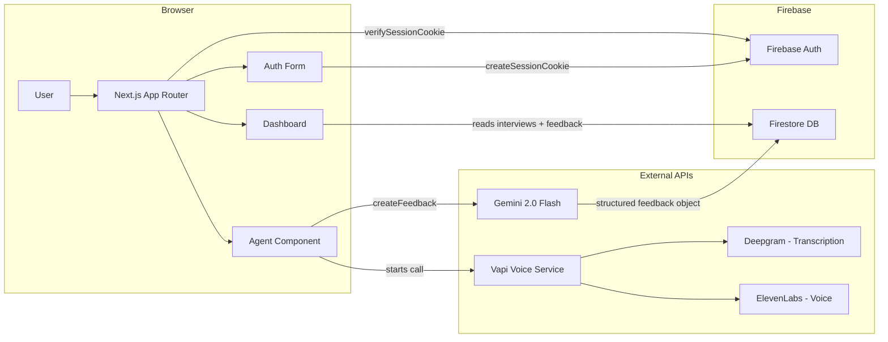
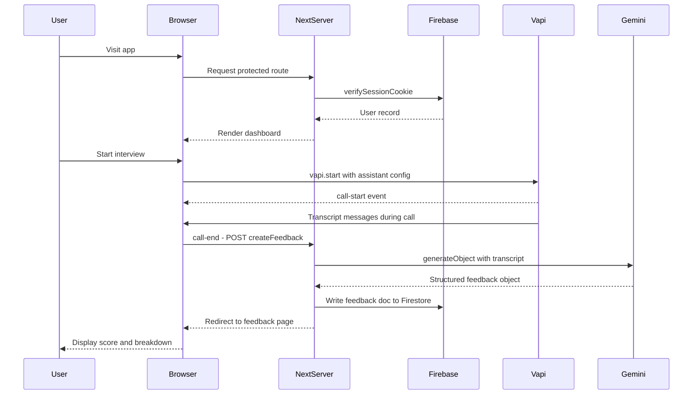
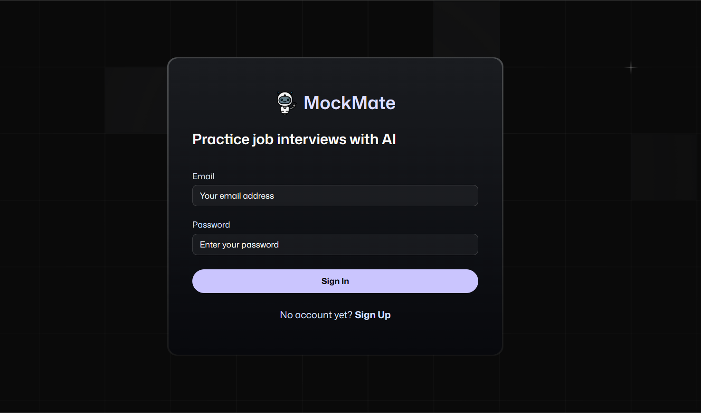
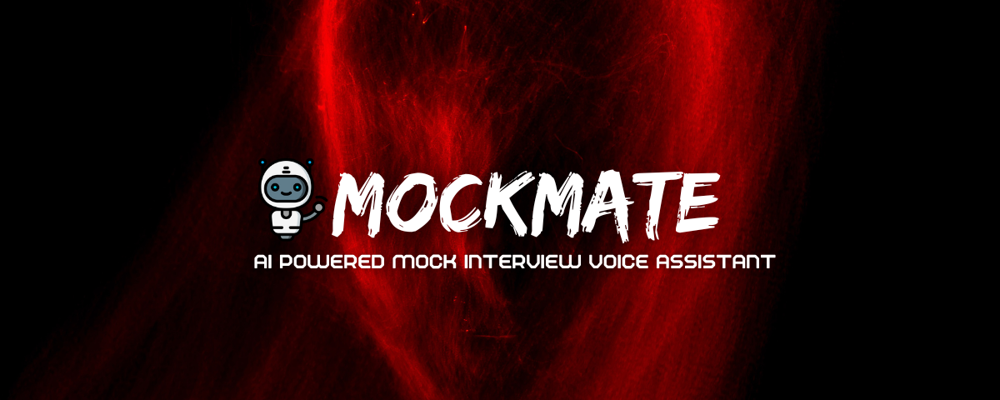
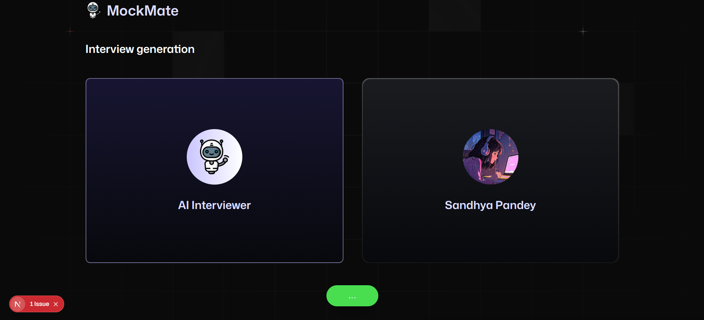
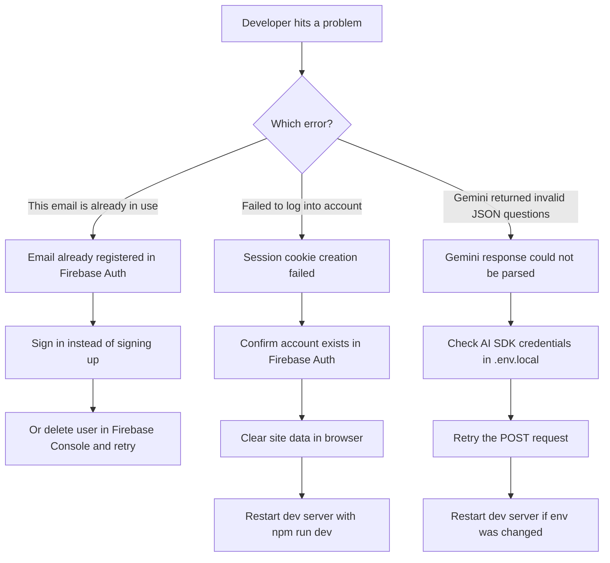

<div align="center">

# 👩🏻‍💻MockMate

> *"An AI-powered mock interview platform with live voice sessions, structured feedback, and a protected dashboard — all in one place."*


[](https://ai.google.dev/)
[](http://makeapullrequest.com)
<!-- [](https://opensource.org/licenses/ISC) -->


[ Get Started ](#-installation) • [ Features ](#-features) • [ Screenshots ](#-screenshots) • [ Architecture ](#-architecture)  • [ Contribute ](#-contributing)


</div>

---

## 😤 The Problem

Most interview prep tools hand you a list of questions and leave you alone with a text box. That's nothing like a real interview — no pressure, no pacing, no one pushing back. 

MockMate replaces that static experience with a live AI voice interviewer that actually talks to you, captures what you say, and tells you exactly what went well and what didn't. Practice like it's real, review like it's measurable.

<div align="center">

[ Live Link ](mock-mate-nu-nine.vercel.app/)  • [ Source Code](https://github.com/sandhya144/MockMate.git)

</div>


---

## ✨ Features

| Feature | Description |
|---|---|
| 🔐 Auth | Email/password sign-up and sign-in via Firebase, with protected and auth route layouts |
| 📋 Dashboard | Separates past interviews from available ones; each card links to the right next action |
| 🎙 Voice Interviews | Live sessions powered by Vapi with real-time transcript capture and call-state UI |
| 🤖 AI Feedback | Gemini 2.0 Flash generates structured feedback saved to Firestore |
| 🧠 Smart Scoring | Feedback includes total score, category breakdowns, strengths, and improvement areas |
| 🖼 Tech Badges | Normalizes stack names, fetches Devicon CDN logos, falls back to a local SVG |
| 🌙 Dark UI | Responsive dark-themed layout with Tailwind CSS and Mona Sans |

---

## 🏗 Architecture


```mermaid
graph LR
    subgraph Browser
        A[User] --> B[Next.js App Router]
        B --> C[Auth Form]
        B --> D[Dashboard]
        B --> E[Agent Component]
    end

    subgraph Firebase
        F[Firebase Auth]
        G[Firestore DB]
    end

    subgraph External APIs
        H[Vapi Voice Service]
        I[Gemini 2.0 Flash]
        J[Deepgram - Transcription]
        K[ElevenLabs - Voice]
    end

    C -->|createSessionCookie| F
    D -->|reads interviews + feedback| G
    E -->|starts call| H
    H --> J
    H --> K
    E -->|createFeedback| I
    I -->|structured feedback object| G
    B -->|verifySessionCookie| F
```

---

## ⚙️ Tech Stack

| Layer | Technology |
|---|---|
| Framework | Next.js 15 (App Router) |
| Language | TypeScript |
| UI | React 19 |
| Styling | Tailwind CSS 4, `tailwindcss-animate` |
| Components | shadcn/ui, Radix UI, `lucide-react` |
| Forms | `react-hook-form`, `zod`, `@hookform/resolvers` |
| Authentication | Firebase Auth (client + Admin SDK) |
| Database | Firestore |
| Voice | `@vapi-ai/web` |
| AI Generation | `@ai-sdk/google`, Gemini 2.0 Flash |
| Notifications | `sonner` |
| Date Formatting | `dayjs` |
| Font | Mona Sans via `next/font/google` |

---

## 🔄 How It Works


```mermaid
sequenceDiagram
    participant User
    participant Browser
    participant NextServer
    participant Firebase
    participant Vapi
    participant Gemini

    User->>Browser: Visit app
    Browser->>NextServer: Request protected route
    NextServer->>Firebase: verifySessionCookie
    Firebase-->>NextServer: User record
    NextServer-->>Browser: Render dashboard

    User->>Browser: Start interview
    Browser->>Vapi: vapi.start with assistant config
    Vapi-->>Browser: call-start event
    Vapi->>Browser: Transcript messages during call
    Browser->>NextServer: call-end - POST createFeedback
    NextServer->>Gemini: generateObject with transcript
    Gemini-->>NextServer: Structured feedback object
    NextServer->>Firebase: Write feedback doc to Firestore
    NextServer-->>Browser: Redirect to feedback page
    Browser-->>User: Display score and breakdown
```

---

## 📸 Screenshots






---

## 🚀 Installation

1. **Clone the repository and open the project root:**

```powershell
cd "c:\Users\sndy6\OneDrive\Desktop\interview ai\MockMate"
```

2. **Install dependencies:**

```powershell
npm install
```

3. **Create `.env.local` and add the required values:**

```env
NEXT_PUBLIC_VAPI_WEB_TOKEN=your_vapi_web_token
NEXT_PUBLIC_VAPI_WORKFLOW_ID=your_vapi_workflow_id
FIREBASE_PROJECT_ID=your_firebase_project_id
FIREBASE_CLIENT_EMAIL=your_firebase_client_email
FIREBASE_PRIVATE_KEY=your_firebase_private_key
```

> **Note:** The Firebase client config (`firebase/client.ts`) is currently hardcoded. The `.env.local` values above cover Vapi and Firebase Admin only.

4. **Start the development server:**

```powershell
npm run dev
```

Open [http://localhost:3000](http://localhost:3000) to see the app.

---

## 📁 Project Structure

```text
MockMate
├── app
│   ├── (auth)
│   │   ├── layout.tsx                 # Redirect authenticated users
│   │   ├── sign-in
│   │   │   └── page.tsx
│   │   └── sign-up
│   │       └── page.tsx
│   │
│   ├── (root)
│   │   ├── interview
│   │   │   ├── page.tsx               # Generate interview
│   │   │   └── [id]
│   │   │       ├── page.tsx           # Live interview
│   │   │       └── feedback
│   │   │           └── page.tsx       # Interview feedback
│   │   │
│   │   ├── layout.tsx                 # Protected application shell
│   │   └── page.tsx                   # Dashboard
│   │
│   ├── api
│   │   └── vapi
│   │       └── generate
│   │           └── route.ts           # Generate interview questions
│   │
│   ├── globals.css
│   └── layout.tsx
│
├── components
│   ├── ui                            # shadcn/ui reusable components
│   ├── Agent.tsx
│   ├── AuthForm.tsx
│   ├── DisplayTechIcons.tsx
│   └── InterviewCard.tsx
│
├── constants
│   └── index.ts
│
├── firebase
│   ├── admin.ts
│   └── client.ts
│
├── lib
│   ├── actions
│   │   ├── auth.action.ts
│   │   └── general.action.ts
│   ├── utils.ts
│   └── vapi.sdk.ts
│
├── public
│   ├── covers
│   ├── banner.png
│   ├── logo.svg
│   └── ...
│
├── types
│   ├── index.d.ts
│   └── vapi.d.ts
│
├── package.json
├── next.config.ts
├── tsconfig.json
└── README.md
```

---

## 📡 API Reference

### `GET /api/vapi/generate`

Health check endpoint.

**Response:**
```json
{
  "success": true,
  "data": "Thank you!"
}
```

---

### `POST /api/vapi/generate`

Generates interview questions with Gemini and saves the interview to Firestore.

**Request body:**
```json
{
  "type": "technical",
  "role": "Frontend Developer",
  "level": "Junior",
  "techstack": "React,TypeScript,Next.js",
  "amount": 5,
  "userid": "firebase-user-id"
}
```

**Success response:**
```json
{
  "success": true,
  "id": "firestore-document-id"
}
```

**Error response:**
```json
{
  "success": false,
  "error": "Gemini returned invalid JSON questions"
}
```

---

## 🛠 Troubleshooting


```mermaid
flowchart TD
    Start[Developer hits a problem] --> Q1{Which error?}

    Q1 -->|This email is already in use| A1[Email already registered in Firebase Auth]
    A1 --> A2[Sign in instead of signing up]
    A2 --> A3[Or delete user in Firebase Console and retry]

    Q1 -->|Failed to log into account| B1[Session cookie creation failed]
    B1 --> B2[Confirm account exists in Firebase Auth]
    B2 --> B3[Clear site data in browser]
    B3 --> B4[Restart dev server with npm run dev]

    Q1 -->|Gemini returned invalid JSON questions| C1[Gemini response could not be parsed]
    C1 --> C2[Check AI SDK credentials in .env.local]
    C2 --> C3[Retry the POST request]
    C3 --> C4[Restart dev server if env was changed]
```

<details>
<summary>🔴 <strong>This email is already in use</strong></summary>

**Why it happens:** `Authform.tsx` calls Firebase Auth first; if the email already exists, sign-up is rejected before writing to Firestore.

**Fix:** Sign in with the same email. To force a fresh account, delete the existing Firebase Auth user from the Firebase Console and retry.

</details>

<details>
<summary>🔴 <strong>Failed to log into account. Please try again.</strong></summary>

**Why it happens:** The sign-in server action could not create the session cookie — usually because the Firebase Auth user is missing, the ID token wasn't produced, or the browser holds a stale session.

**Fix:** Confirm the account exists, clear browser site data, and restart the dev server:
```powershell
npm run dev
```

</details>

<details>
<summary>🔴 <strong>Gemini returned invalid JSON questions</strong></summary>

**Why it happens:** The POST handler in `app/api/vapi/generate/route.ts` expected a JSON object with a `questions` array, but Gemini's response could not be cleanly parsed.

**Fix:** Confirm `@ai-sdk/google` credentials are set in `.env.local`, retry the request, then restart if you made env changes:
```powershell
npm run dev
```

</details>

---

## 🗺 Roadmap

- [ ] Wire `/api/vapi/generate` into the visible UI or remove it if the Vapi workflow is the only intended generation path
- [ ] Move hardcoded Firebase client config out of `firebase/client.ts` into environment variables
- [ ] Stop suppressing lint and TypeScript errors in `next.config.ts` so build failures surface early
- [ ] Restore an explicit empty-state UI for missing feedback on the feedback page
- [ ] Add loading and error states around the Vapi call lifecycle in `Agent.tsx`
- [ ] Add a `LICENSE` file to make the repository's reuse terms explicit

---

## 🤝 Contributing

```powershell
# 1. Start from the latest main branch
git checkout main

# 2. Pull latest changes
git pull origin main

# 3. Create a feature branch
git checkout -b feature/your-feature-name

# 4. Verify changes locally
npm run dev

# 5. Stage and commit
git add .
git commit -m "feat: describe your change"

# 6. Push and open a PR
git push -u origin feature/your-feature-name
```

Open a pull request from your branch into `main` and review the diff before merging.

---

## 📬 Contact & Acknowledgements

**Author:** Sandhya Pandey

Built with 💖 [Next.js](https://nextjs.org/), [Firebase](https://firebase.google.com/), [Vapi](https://vapi.ai/), and [Google Gemini](https://deepmind.google/technologies/gemini/).

<div align="center">


[⬆ Back to top](#mockmate)


---